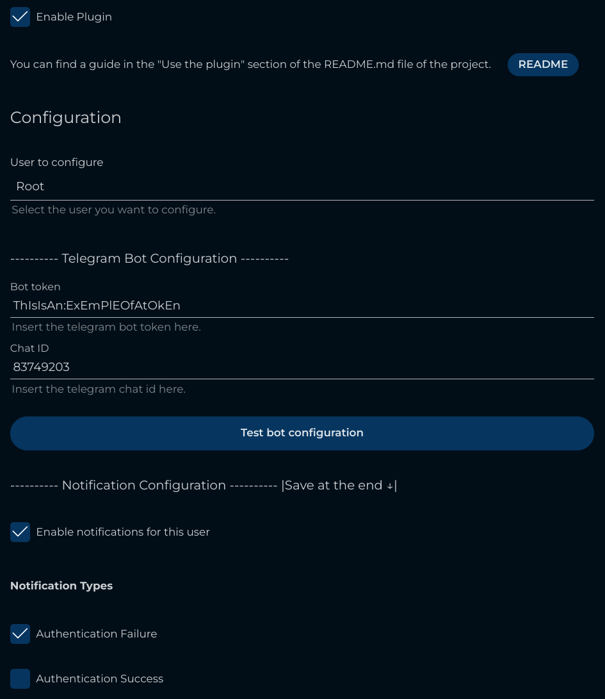

# Jellyfin Plugin Telegram Notifier

This project is a [Jellyfin](https://github.com/jellyfin) plugin that easily sends notifications to a Telegram bot when something happens on the server (like a new media added, a media deleted, etc.).

<div style="text-align:center;">
    
</div>


## Table of contents

- [Install the plugin](#install-the-plugin)
- [Use the plugin](#use-the-plugin)
- [Install the project (for developers)](#install-the-project-for-developers)

## Install the plugin

To install the plugin on your Jellyfin server, you need to follow these steps:

1. Go to the Jellyfin dashboard
2. Go to the **Plugins** section
3. Go to the **Repository** tab
4. Add the depot URL: 

Repository Name: ```Telegram Notifier```

Repository URL:
```
https://raw.githubusercontent.com/RomainPierre7/jellyfin-plugin-TelegramNotifier/main/manifest.json
```

5. Go to the **Catalog** tab
6. Search for the plugin: ```Telegram Notifier```
7. Click on the **Install** button
8. Restart the Jellyfin server

> **Note:** You can also install the plugin manually by downloading the latest release from the [releases page](https://github.com/RomainPierre7/jellyfin-plugin-TelegramNotifier/releases).

## Use the plugin

To use the plugin, you need to follow these steps:

1. Go to the Jellyfin dashboard
2. Go to the **Plugins** section
3. Go to the **My Plugins** tab
4. Click on the **Telegram Notifier** plugin
5. Configure the plugin

### Configuration

1. Select the user you want to configure
2. Enter the Telegram bot token
> **Note:** You can create a Telegram bot by sending the command ```/newbot``` to the [BotFather](https://t.me/botfather) and collect the token.
3. Enter the chat ID
> **Note:** You can get the collect the chat ID by sending a message to the bot and then go to the URL: ```https://api.telegram.org/bot<YourBOTToken>/getUpdates```
4. Click on the **Test** button to test the configuration
5. Enable the notifications for the user
6. Select the events you want to be notified about

Available events:
- Item added
- Generic
- Playback start
- Playback progress
- Playback stop
- Subtitle download failure
- Authentication failure
- Authentication success
- Session start
- Pending restart
- Task completed
- Plugin installation cancelled
- Plugin installation failed
- Plugin installed
- Plugin installing
- Plugin uninstalled
- Plugin updated
- User created
- User deleted
- User locked out
- User password changed
- User updated
- User data saved


7. Click on the **Save** button

**Example of the configuration page configuration:**



## Install the project (for developers)

To install the project, you need to follow these steps:

> **Note:** You need to have the [.NET 6.0 SDK](https://dotnet.microsoft.com/download) installed on your machine.

1. Clone the repository
2. Install the dependencies
3. Compile the plugin

### 1. Clone the repository

```bash
git clone https://github.com/RomainPierre7/jellyfin_telegram_notifier.git
```

### 2. Install the dependencies

```bash
dotnet add package Jellyfin.Model
dotnet add package Jellyfin.Controller
```

### 3. Compile the plugin

```bash
dotnet build
```

or use the **Makefile**:

This command will only build the dll file in the ```plugin``` directory.

```bash
make dev
```

Other commands are available in the **Makefile**:

- ```make build``` - Build the project
- ```make publish``` - Publish the project
- ```make clean``` - Clean the project
- ```make dev``` - Build the project and copy the `dll` file in the ```plugin``` directory
- ```make plugin``` - Publish the project and copy the `dll` file in the ```plugin``` directory